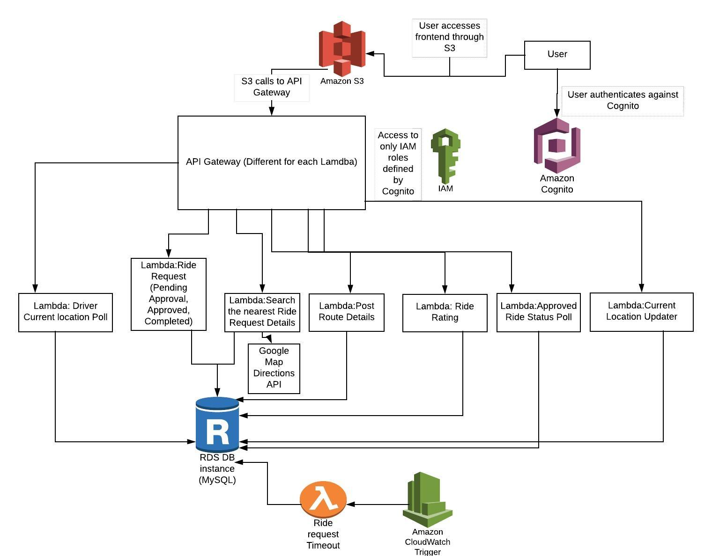

# AWS-Cloud-RideShare-App
Carpooling Service where people can share rides with other people travelling on the same route
## Synopsis
**Project Idea:** 
1. A carpooling service, where people can share rides with other people travelling on the same route. Thus reducing the traffic on road. 
2. Our aim was to create a mobile app using AWS cloud services stack and Google Maps API that allows users to securely coordinate small transfers in the city. The app is able to accommodate requests from users travelling on the same route and is also able to make small deviations according to user’s comfort.

**Architecture Diagram:** 

**Additional API Used:** 
1. ***Google Geocoding API:*** Used to map physical address to latitude and longitude on the map
2. ***Google Maps Driving Direction API:*** Calculates directions between locations

**Project Deliverables:** 
1. A sign-up and log-in page  with email verification
2. Driver can set up their route or trip  (GPS Enabled)
3. Rider can set up their route or trip  (GPS Enabled)
4. Rider can search for Driver on their route and vice versa (Used Haversine Formula)
5. Riders can send, approve and decline ride request of Driver and vice versa
6. Driver and Rider Rating after completion of ride
7. Profile page for each user
8. Web and Android App

**Future Work:** 
1. Need to implement measures to improve trust and privacy between users sharing rides. 
2. Some ideas possible to implement: Driver’s license  and vehicle registration verification
3. Payment option using third party payment system [Such as Square / Paypal]

